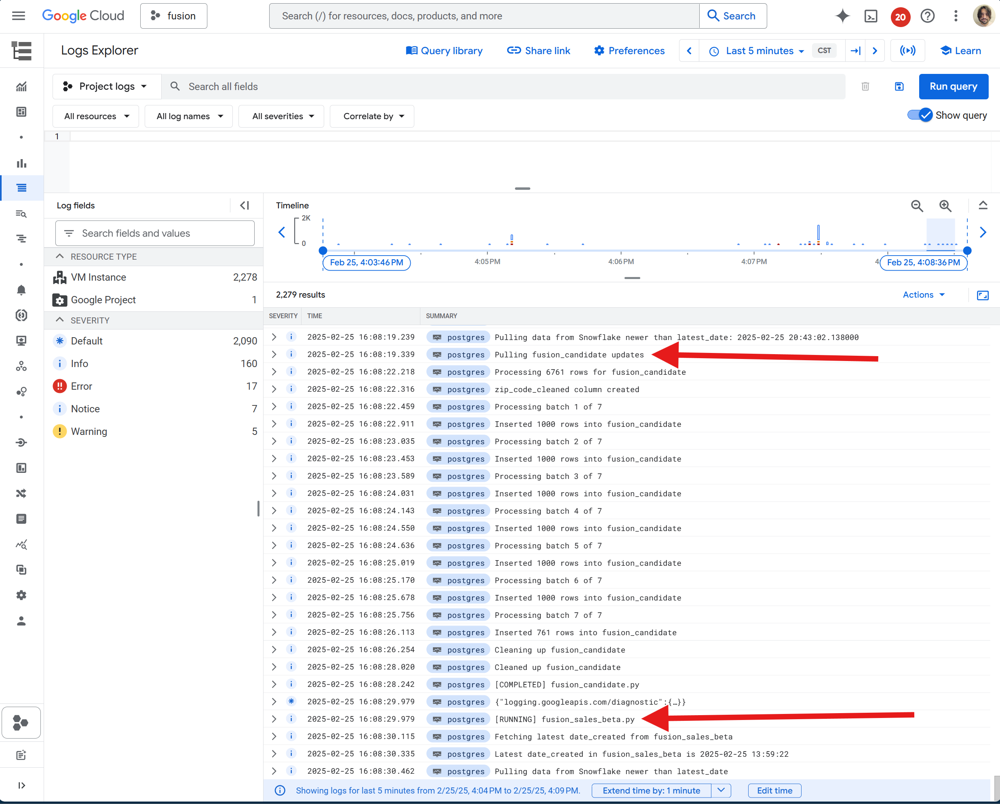
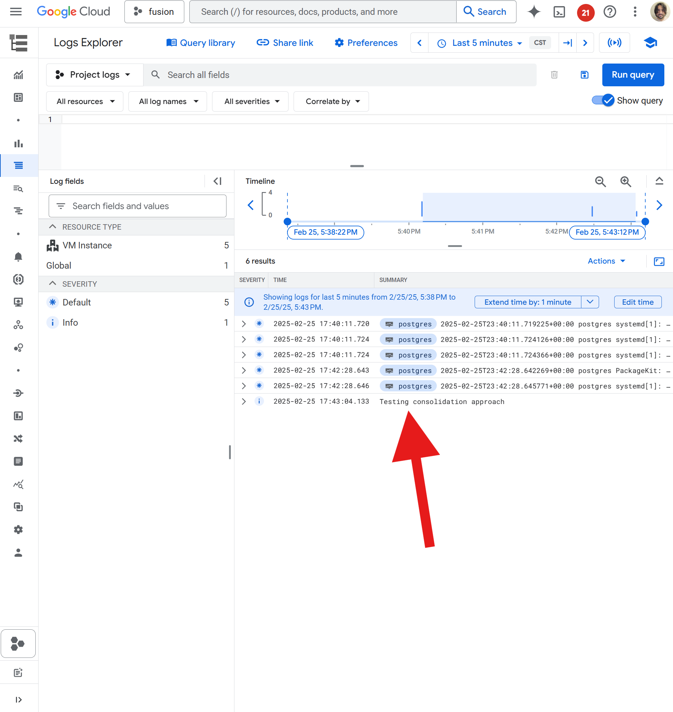

# alshidata

The `alshidata` package is a set of tools put together by The Data Team @ [Alshival's Data Service](alshival.com).

## Google Cloud Platform (GCP): Logger
If you are using Google Cloud Platform to host virutal machines which are running your python code, you may want logs to appear on the GCP's **Logs Explorer**.


Our logger is meant to behave similarly to the `logging` package, not serve as a sophisticated substitite. More work could be done to build out GCP's logger. 

To set this up, [Google provides some documentation](https://cloud.google.com/logging/docs/write-query-log-entries-python#getting_started). You will have to create a service account in your project, create a key file, then define the system variable 

```.bashrc
EXPORT GOOGLE_APPLICATION_CREDENTIALS="/path/to/credentials.json"`
```

Or you can set the variable temporarily in your script:


```python
import os

os.environ['GOOGLE_APPLICATION_CREDENTIALS'] = "path/to/credentials.json"
```

To start tracking logs, simply add `from alshidata.google import Logger`, and use the `logging` package as you always would.


```python
from alshidata.google import Logger 
import logging 

logging.info("Testing consolidation approach")
```

If you check the Log Explorer, you should see the log you just added.


